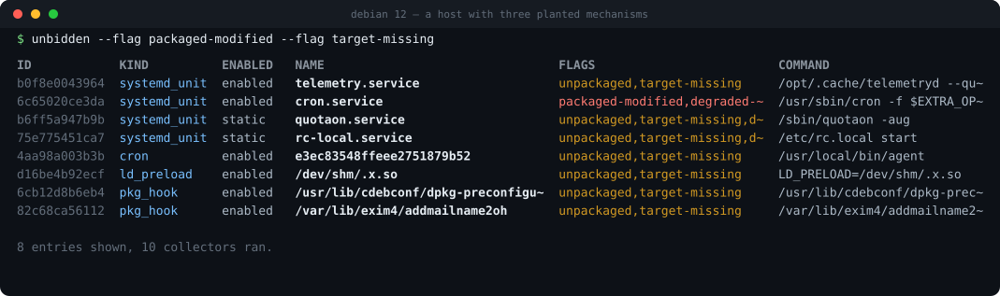

# unbidden

Finds everything that runs on Linux without anyone asking.

[](https://github.com/tire-fire/unbidden/actions/workflows/ci.yml)
[](https://crates.io/crates/unbidden)
[](LICENSE)



systemd units and timers, cron and at, udev rules, PAM, sudoers, SSH keys, XDG
autostart, GNOME and Cinnamon extensions, package manager hooks, shell startup
files, rc.local, SysV init. If it runs without a person typing something, it
should turn up here.

Most of what it finds is boring. A desktop has well over a thousand autostart
entries. Nearly all of them came from a package and nobody has touched them
since. unbidden reads the dpkg and rpm databases itself and hides those, so you
get the short list instead. On the host in the screenshot a plain `unbidden`
hid 1,690 entries; the command shown narrows what's left to two flags.

## Install

```sh
cargo install unbidden
```

There are static binaries in [releases](https://github.com/tire-fire/unbidden/releases)
too. They're musl, so they'll run on anything from RHEL 7 to Alpine without
installing a thing first.

## Use

```sh
unbidden                          # the short list
unbidden --all --json             # everything, one record per line
unbidden --flag unpackaged        # also packaged-modified, world-writable, ...
unbidden --kind cron --trigger login
unbidden --deep                   # adds SUID, file caps, git hooks (walks the disk)
unbidden --save base.json         # and later:
unbidden --against base.json      # what changed?
unbidden explain 8f4e03c59dff     # one entry in full, with the text it came from
```

An entry's id doesn't move when the entry's contents do. A backdoor that
rewrites its own `ExecStart` shows up as one changed row telling you which
fields moved, instead of a removal and an addition you have to notice are the
same thing.

## What it won't do

It doesn't run anything on the machine it's looking at. `rpm`, `dpkg` and
`systemctl` are binaries an attacker can replace, so everything here comes from
reading files and kernel interfaces, or from talking to systemd over a socket.
Same reason it's statically linked: `/etc/ld.so.preload` is a persistence
mechanism in its own right, and a dynamically linked scanner loads whatever it
says before `main()`.

**A kernel-level compromise beats it.** A module that unlinks itself isn't
visible to anything running in userspace, this included. It's good against the
file-backed persistence that makes up almost everything real. Don't read a
clean report as a clean machine.

Accounts come out of `/etc/passwd`, because a static binary has no NSS. An LDAP
or SSSD account with nothing on local disk won't be picked up.

## Supported

| | | |
| --- | --- | --- |
| Debian | 12, 13 | dpkg |
| Ubuntu | 22.04, 24.04 | dpkg, snap |
| Linux Mint | 21.x, LMDE | dpkg, Cinnamon |
| Fedora | current, current-1 | rpm (sqlite) |

Anything else works on a best-effort basis. With no package database it reports
provenance as unknown rather than calling every file on the box unpackaged.

Mint 22.x isn't tested. Nobody publishes an image that's actually Mint 22, and
underneath it's Ubuntu noble with Cinnamon on top. Both are already covered.

## Testing

`cargo test` covers the collectors, and adds a golden record of a full scan plus
a mutation pass that takes a synthetic tree apart 120 different ways. CI runs
the packaging checks against eight distro images, boots real GNOME and Cinnamon
sessions, and fuzzes the parsers.

`ci/vm-harness.sh` boots a throwaway VM, installs
[PANIX](https://github.com/Aegrah/PANIX), and for every mechanism PANIX can
plant it does the same loop: plant it, scan, check it showed up with the right
kind, revert it, scan again, check the diff came back clean. The second scan is
the one that catches entries still being reported after the mechanism is gone.

## Licence

MIT.
