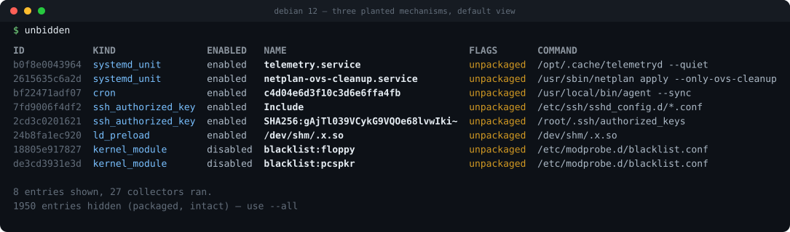

# unbidden

Finds what runs automatically on Linux.

[](https://github.com/tire-fire/unbidden/actions/workflows/ci.yml)
[](https://crates.io/crates/unbidden)
[](LICENSE)



What it reads, grouped by when each thing runs:

- Boot: systemd units, generators and presets, SysV init scripts and
  rc.local, inittab, OpenRC services and local.d, kernel modules and modprobe `install` lines, tmpfiles.d, what
  builds the initramfs (initramfs-tools, dracut, DKMS), cloud-init,
  crypttab keyscripts, display-manager scripts, systemd's sleep and
  shutdown hooks
- A schedule: cron (Vixie and BusyBox), anacron, at, systemd timers,
  logrotate scripts
- Login: shell startup files for bash, zsh, csh, fish and ksh, the X
  session, XDG autostart and the GNOME, MATE and Plasma session files,
  GNOME and Cinnamon extensions, file-manager extensions, browser policy,
  MOTD scripts, the system-wide startup files of editors, tmux and screen,
  SSH keys and the sshd settings that decide which keys count, membership
  of groups that grant root
- Authentication: PAM, sudoers (aliases resolved) and sudo plugins, doas,
  polkit rules, what the ssh client runs
- A device, network or system event: udev rules, NetworkManager, DHCP,
  ifupdown, networkd-dispatcher, PPP, WireGuard and OpenVPN hooks, xinetd
  and inetd services, TCP wrappers, fail2ban actions, and the handlers of
  acpid, smartd, zed, apport, ClamAV, SpamAssassin, ModemManager and a
  dozen more daemons
- Monitoring and management agents: auditd plugins, collectd, munin,
  monit, Zabbix, NRPE, incron, facter, Salt schedules
- Package installs: apt, dnf and dpkg hooks, kernel package hooks, dpkg,
  rpm and apk scriptlets and triggers, package sources and the keys trusted
  to sign them, alternatives and diversions
- Any time, or whenever something asks: `ld.so.preload`, library search
  paths, NSS modules, D-Bus services, Python startup hooks, interpreter
  variables, the plug-in registries of gconv, p11-kit, Vulkan, EGL, OpenCL
  and gdk-pixbuf, rsyslog and CUPS, and what the kernel runs itself
  (`core_pattern`, binfmt_misc, request-key)
- With `--deep`: setuid binaries, file capabilities, hooks in every git
  repository, and every packaged program or library whose contents differ
  from what its package shipped

Each is read by the rule of the program that runs it, and only where that
program is installed; [spec.md](spec.md) §5 has the full list and why.

If it runs without a person typing something, it should turn up here.

Most of what turns up is noise. A desktop has well over a thousand autostart
entries, nearly all of them from a package and untouched since. unbidden reads
the dpkg, rpm and apk databases itself and hides those, so you get the short
list. The screenshot is a fresh Debian 12 cloud image with three mechanisms
planted the way an intruder leaves them — `telemetry.service`, the cron job
running `/usr/local/bin/agent`, and the library in `/etc/ld.so.preload` — and
nothing filtered: 1,950 entries hidden, 8 shown. The other five are what the
image honestly carries: root's ssh key, an `sshd_config` the image edited, the
builder's modprobe blacklist, and netplan's runtime unit.

## Install

The binaries in [releases](https://github.com/tire-fire/unbidden/releases) are
musl, so they're static and they'll run on anything from RHEL 7 to Alpine
without installing a thing first.

```sh
cargo install unbidden
```

works too, but it links against your system libc. For a static one, build it
against musl:

```sh
rustup target add x86_64-unknown-linux-musl
cargo install unbidden --target x86_64-unknown-linux-musl
```

To fetch the release binary without compiling:

```sh
cargo binstall unbidden
```

The releases also carry a `.deb` and an `.rpm` for x86_64 and aarch64. They
hold the same static binary and depend on nothing, so one package serves every
Debian, Ubuntu, Fedora or derivative host of its architecture:

```sh
sudo apt install ./unbidden_<version>_amd64.deb
sudo dnf install ./unbidden-<version>-1.x86_64.rpm
```

Every file in a release, packages included, has build provenance from the
workflow that made it. To check a download came from this repository's CI:

```sh
gh attestation verify unbidden-x86_64-unknown-linux-musl --repo tire-fire/unbidden
```

## Use

```sh
unbidden                          # the short list
unbidden --all --json             # everything, one record per line
unbidden --flag unpackaged        # also packaged-modified, world-writable, ...
unbidden --kind cron --trigger login
unbidden --deep                   # adds SUID, file caps, git hooks (walks the disk)
unbidden --save base.json         # and later:
unbidden --against base.json      # what changed?
unbidden explain 8f4e03c59dff     # one entry in full, with the text it came from
```

An entry's id doesn't move when the entry's contents do. A backdoor that
rewrites its own `ExecStart` shows up as one changed row telling you which
fields moved, instead of a removal and an addition you have to notice are the
same thing.

## Limits

It doesn't execute anything on the host it scans. `rpm`, `dpkg` and
`systemctl` are binaries an attacker can replace, so everything here comes from
reading files and kernel interfaces, or from talking to systemd over a socket.
Same reason the released binaries are static: `/etc/ld.so.preload` is a
persistence mechanism in its own right, and a dynamically linked scanner loads
whatever it says before `main()`.

Kernel-level compromise is out of scope. A module that unlinks itself isn't
visible to anything running in userspace, this included. unbidden covers
file-backed persistence, so a clean report isn't the same as a clean machine.

Accounts come out of `/etc/passwd`, because a static binary has no NSS. An LDAP
or SSSD account with nothing on local disk won't be picked up.

## Supported

| Distro | Versions | Package database | Extras |
| --- | --- | --- | --- |
| Debian | 12, 13 | dpkg | |
| Ubuntu | 22.04, 24.04 | dpkg | snap |
| Linux Mint | 21.x, 22.x, LMDE | dpkg | Cinnamon |
| Fedora | current, current-1 | rpm (sqlite) | |
| Alpine | 3.22, current-1, current | apk | OpenRC, BusyBox |

Anything else works on a best-effort basis. With no package database it reports
provenance as unknown rather than calling every file on the box unpackaged.

The published Mint 22 container image reports itself as Ubuntu 24.04. CI
installs Mint's own `base-files` from the Mint repository it already points
at, which makes it Mint 22, and tests that.

## Testing

`cargo test` covers the collectors, a golden record of a full scan, a
mutation pass that takes a synthetic tree apart 120 ways, and a lint that
keeps every module off the filesystem except through the scan root. Every
parser has a `cargo-fuzz` target.

CI runs the release binary in all twelve supported images and checks its
verdicts against the image's own `rpm`, `dpkg` or `apk`: who owns each file, and
whether it is intact. It boots real GNOME and Cinnamon sessions. It also
plants every mechanism [PANIX](https://github.com/Aegrah/PANIX) supports that
is in scope, and checks that each is reported, from the right place and tied
to the planted payload, and that it stops being reported once reverted. That
runs in a VM for Debian, Ubuntu and Fedora (`ci/vm-harness.sh`) and in a
systemd container for Mint and LMDE (`ci/container-harness.sh`).
`ci/panix-coverage.tsv` lists every PANIX module with its ATT&CK technique,
including the ones out of scope and why.
`ci/attack-coverage.tsv` goes the other way: every ATT&CK Linux
persistence technique, with the entry kinds that report it or the decision
that puts it out of scope, and a test fails when one has no answer.

## License

MIT.
